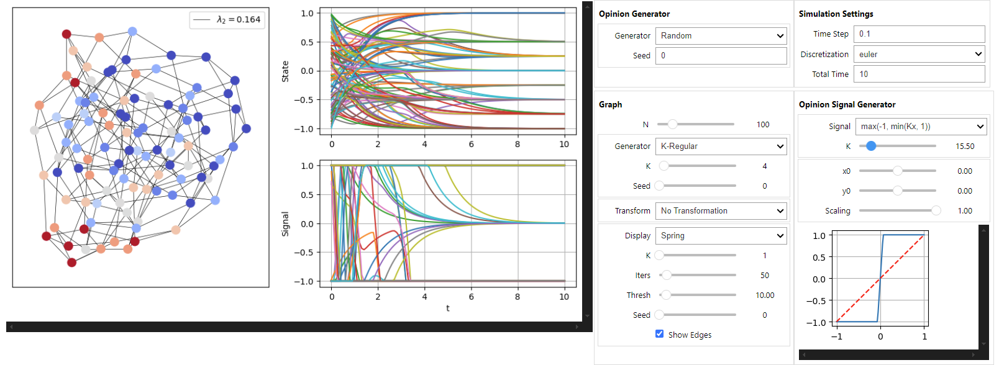

# COSA-Simulator: Nonlinear Consensus & Synchronization



COSA-Simulator is an interactive Jupyter Notebook for studying consensus and synchronization in multi-agent systems with nonlinear interactions. It serves as the official companion tool for the paper: **"Global synchronization of multi-agent systems with nonlinear interactions"** and upcoming ones.

This simulator allows researchers and students to visually and intuitively explore the complex dynamics of networked agents. Users can manipulate network topology, define custom nonlinear signal functions, and observe the system's evolution in real-time, making it an ideal tool for both research and educational purposes.

## 1. Scientific Context

The simulator implements the normalized consensus-like dynamics studied in the paper, which models how agents in a network update their state based on information from their neighbors. The system is defined by the following differential equation on an undirected graph with adjacency matrix $A$ and degree matrix $D$:

$$\Large \dot{x}(t) = D^{-1}A s(x(t)) - x(t)$$

Key elements of this model include:
*   **$x(t)$**: A vector representing the state of each agent at time $t$.
*   **$s(\cdot)$**: A general, non-decreasing nonlinear signal function that models how agents perceive or communicate their states. This can represent phenomena like estimation biases, saturation, or quantization effects.
*   **$D^{-1}A$**: The normalized adjacency matrix of the network, which defines the topology of agent interactions.

The research reveals that synchronization equilibria correspond to the fixed points of the signal function $s(\cdot)$, and their stability is determined by the local behavior (underestimation or overestimation) of the signal around these points. This simulator provides a hands-on environment to test these theoretical findings.

## 2. Features

*   **Interactive Simulation**: A user-friendly interface built with `ipywidgets` allows for real-time control over all simulation parameters without rewriting code.
*   **Network Generation**:
    *   Generate standard network topologies like K-Regular, Complete, and Line graphs.
    *   Use a random seed for reproducible experiments.
*   **Nonlinear Signal Control**:
    *   Define a wide range of monotonic, Lipschitz-continuous signal functions $s(\cdot)$.
    *   Interactively adjust parameters (e.g., gain `K`, offsets) and immediately visualize the function's shape.
    *   Includes presets for common functions like linear, affine, and sigmoidal/saturation models.
*   **Rich Visualization**:
    *   View the network graph with nodes colored according to their state.
    *   Plot the time evolution of each agent's state and signal.
    *   Analyze convergence towards synchronization equilibria.
*   **Data Export**:
    *   Save simulation trajectories and results to CSV files.
    *   Export plots as high-quality PNG images for use in manuscripts and presentations.

## 3. Getting Started

### Prerequisites
*   Python 3.9 or higher
*   JupyterLab or Jupyter Notebook

### Installation & Launch
Follow these steps to set up and run the simulator:

1.  **Clone the repository:**
    ```bash
    git clone https://github.com/AnthonyCouthures/COSA-Simulator.git
    cd COSA-Simulator
    ```

2.  **Create and activate a virtual environment:**
    ```bash
    # Create the environment
    python -m venv .venv
    
    # Activate it (Linux/macOS)
    source .venv/bin/activate
    
    # Or, activate it (Windows)
    # .venv\Scripts\activate
    ```

3.  **Install the required dependencies:**
    ```bash
    pip install -r requirements.txt
    ```

4.  **Launch Jupyter:**
    ```bash
    jupyter lab
    # or: jupyter notebook
    ```
5.  **Open and run the notebook:** Navigate to `COSA - Simulator/` and open `Interface.ipynb`. Execute the cells in order to launch the interactive interface.

## 4. Repository Structure

The repository is organized to separate the user interface from the core simulation logic.

```
COSA-Simulator//
│   ├── interface.ipynb     # The main Jupyter notebook with the interactive UI.
│   ├── __init__.py         # Makes the Simulator directory a Python package.
│   └── ...                 # Core Python modules for simulation, graphing, etc.
├── requirements.txt        # A list of Python package dependencies.
├── LICENSE
└── README.md
```
For the simulator to function correctly, the `Simulator` package must be importable by the `Interface.ipynb` notebook. Always run Jupyter from the root of the repository.

## 5. Reproducibility & Contributing

To ensure your experiments are reproducible:
*   **Set the Seed**: Always use a specific integer seed in the UI for any experiment that relies on random generation (e.g., initial conditions, graph topology).
*   **Pin Versions**: The `requirements.txt` file should contain pinned versions of libraries to avoid issues from upstream updates.

## 6. How to Cite

If you use this simulator in your research, please cite the accompanying paper and the software itself.

**Paper:**
```bibtex
@article{couthures2025global,
  title = {Global {{Synchronization}} of {{Multi-Agent Systems With Nonlinear Interactions}}},
  author = {Couthures, Anthony and Varma, Vineeth S. and Lasaulce, Samson and Morărescu, Irinel-Constantin},
  year = {2025},
  journal = {IEEE Control Systems Letters},
  volume = {9},
  pages = {354--359},
  issn = {2475-1456},
  doi = {10.1109/LCSYS.2025.3573563},
  url = {https://ieeexplore.ieee.org/document/11015590}
}
```

**Software:**
```bibtex
@software{cosa-simulator-2025,
  title   = {COSA-Simulator: A Jupyter Simulator for Nonlinear Consensus and Synchronization},
  shorttitle = {COSA-Simulator},
  author  = {Couthures, Anthony},
  year    = {2025},
  url     = {https://github.com/AnthonyCouthures/COSA-Simulator}
}
```

## 7. License

This project is licensed under the MIT License. See the [LICENSE](LICENSE) file for details.


